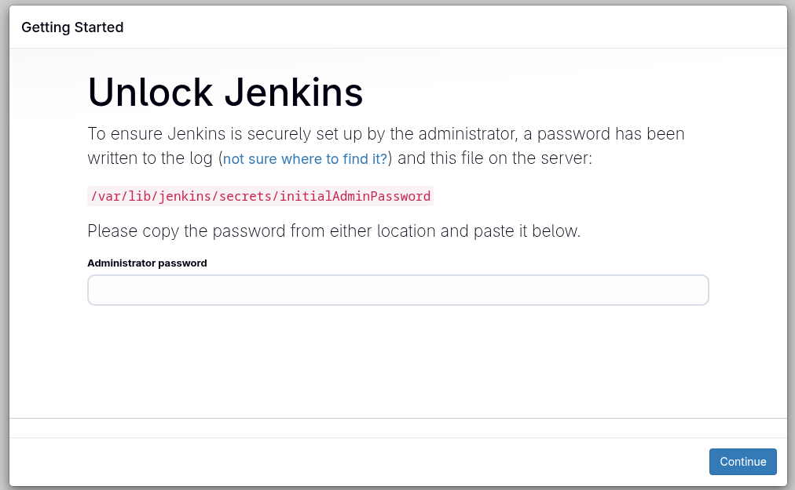
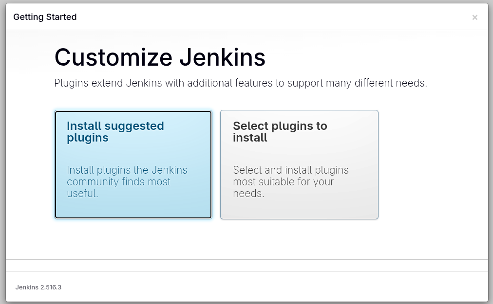

# Set Up Jenkins Server

1. Install **`Jenkins`** on the jenkins server using the **`yum`** utility only, and start its service.
  - If you face a timeout issue while starting the Jenkins service, refer to [this](https://www.jenkins.io/doc/book/system-administration/systemd-services/#starting-services)
2. Jenkin's admin user name should be `theadmin`, password should be `Adm!n321`, full name should be `Mariyam` and email should be `mariyam@jenkins.stratos.xfusioncorp.com`

[Installing Jenkins](https://www.jenkins.io/doc/book/installing/linux/)

```bash
yum install wget -y

wget -O /etc/yum.repos.d/jenkins.repo \
    https://pkg.jenkins.io/redhat-stable/jenkins.repo

rpm --import https://pkg.jenkins.io/redhat-stable/jenkins.io-2023.key

yum install fontconfig java-21-openjdk -y

yum install jenkins -y

systemctl daemon-reload

systemctl enable --now jenkins

systemctl status jenkins

# to get the admin password
cat /var/lib/jenkins/secrets/initialAdminPassword
```
  <details>
  <summary>outputs</summary>

    # systemctl status jenkins

    ● jenkins.service - Jenkins Continuous Integration Server
     Loaded: loaded (/usr/lib/systemd/system/jenkins
    .service; enabled; preset: disabled)
     Active: active (running) since Sat 2025-09-27 15:38:08 UTC; 1min 9s ago
     Main PID: 6604 (java)
      Tasks: 57 (limit: 411140)
     Memory: 662.6M
     CGroup: /docker/f9d0ec70955ed6bf42d5f50c019c3c02e8693471bb33a6b98fe849a8fa20ba5c/system.slice/jenkins.service
             └─6604 /usr/bin/java -Djava.awt.headless=true -jar /usr/share/java/jenkins.war --webroot=/var/cache/jenkins/
    
    # cat /var/lib/jenkins/secrets/initialAdminPassword

    c7df271b77a7495caa9f2a14b0b904d0
  </details>

---

###  Click the `Jenkins` button
  <details>
  <summary>screenshots</summary>
        
  
  
  
  
  

  </details>

