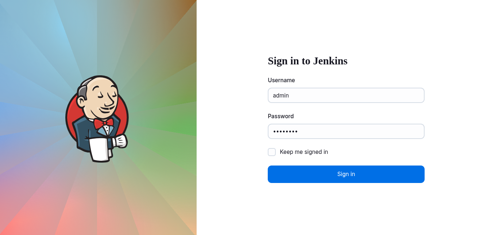
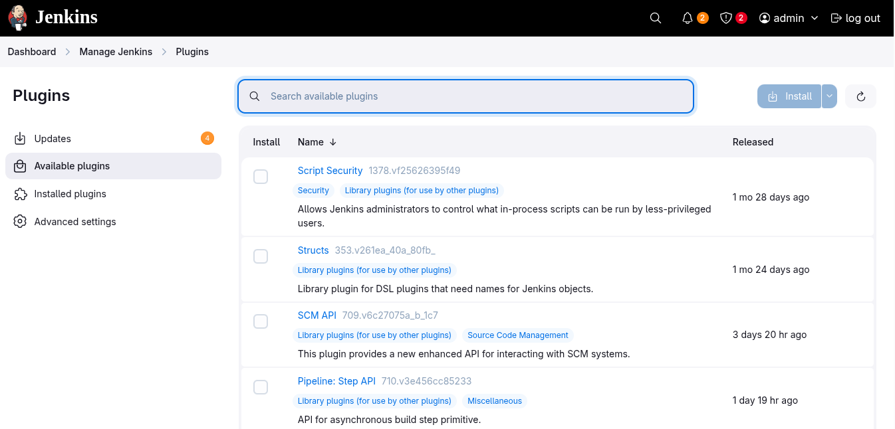
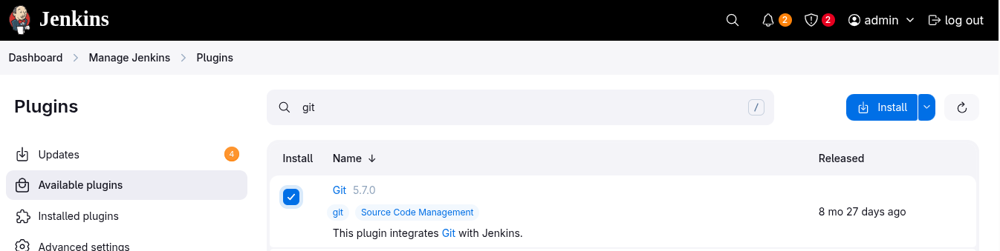
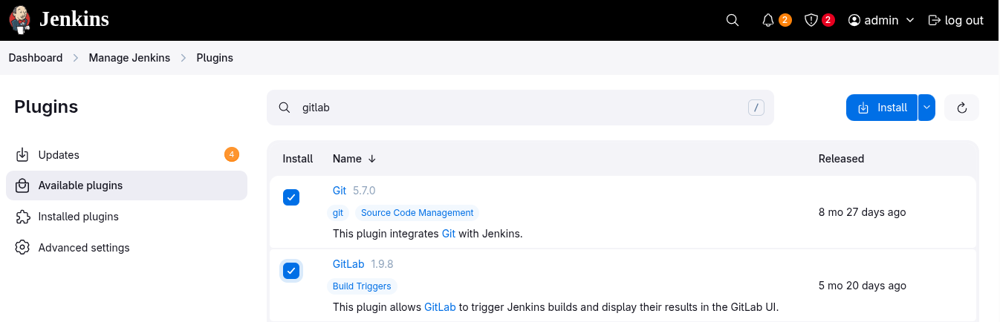
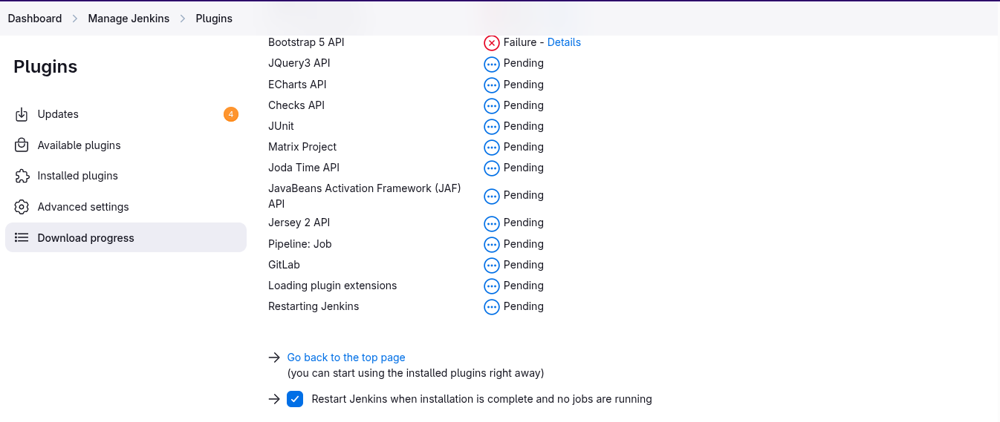
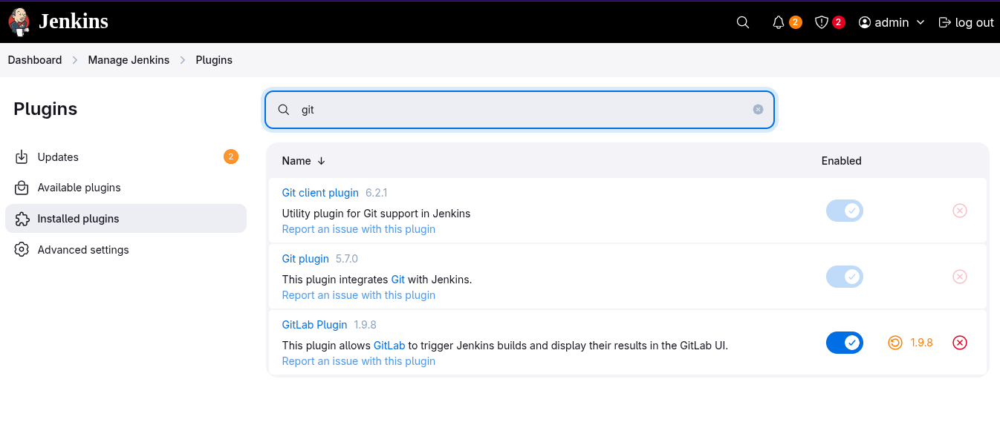
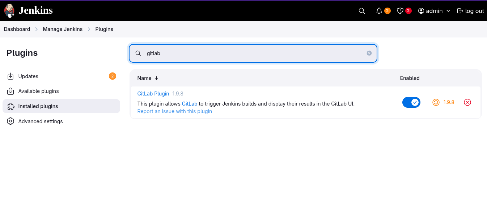

# Install Jenkins Plugins

1. Click on the Jenkins button on the top bar to access the Jenkins UI. Login using username `admin` and `Adm!n321` password
2. Once logged in, install the `Git` and `GitLab` plugins. Note that you may need to restart Jenkins service to complete the plugins installation, If required, opt to `Restart Jenkins when installation is complete and no jobs are running` on plugin installation/update page i.e `update centre`

### login to Jenkins
  
---

### Jenkins Plugin Manager
  1. Click on `Manage Jenkins`
  2. Click on `Plugins`
  
---

### Install `Git` & `Gitlab` plugins
  1. Under the `Available plugins`
  2. check the box
  3. Restart jenkins
  
  
  
---

### Verify installed plugins
  
  