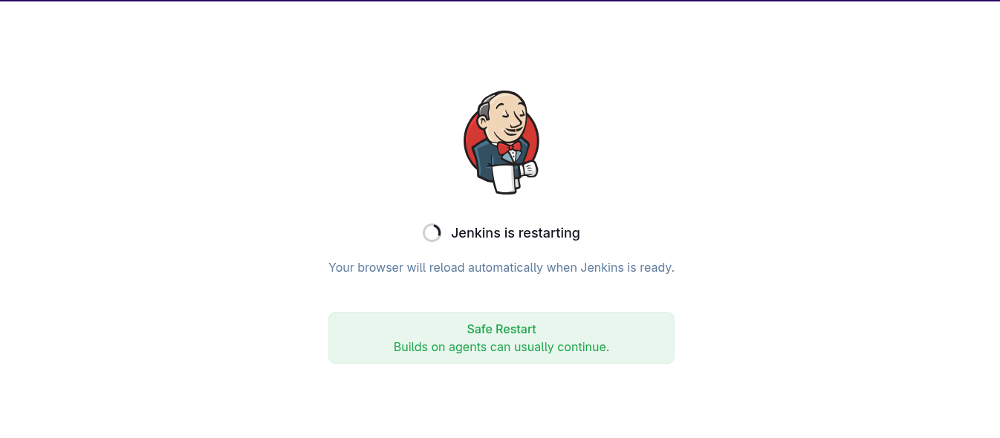
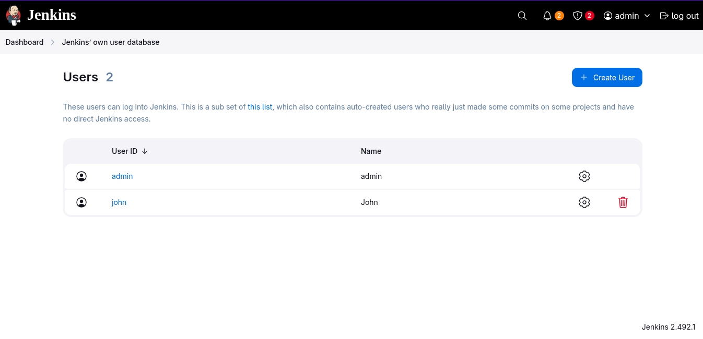

# Configure Jenkins User Access

1. Click on the `Jenkins` button on the top bar to access the Jenkins UI. Login with username `admin` and password `Adm!n321`
2. Create a jenkins user named `john` with the password `GyQkFRVNr3`. Their full name should match `John`
3. Utilize the `Project-based Matrix Authorization Strategy` to assign `overall read` permission to the `john` user
4. Remove all permissions for `Anonymous` users (if any) ensuring that the `admin` user retains overall `Administer` permissions
5. For the existing job, grant `john` user only `read` permissions, disregarding other permissions such as Agent, SCM etc

[Matrix Authorization Strategy](https://plugins.jenkins.io/matrix-auth/)

**`Jenkins Version 2.492.1`**
---

### Install the `Matrix Authorization Strategy` plugin
    
---

### Restart Jenkins
  
  
---

### Verify installed plugins
  
---

### Create a new user
  
  
  
  * login as the `john` user
  
---

### Configure Authorization
  
  
---

### Configure read permission for `john`
  
  
---

### Configure administer permission for `admin`
  
  
---

### Login as john user
  
---