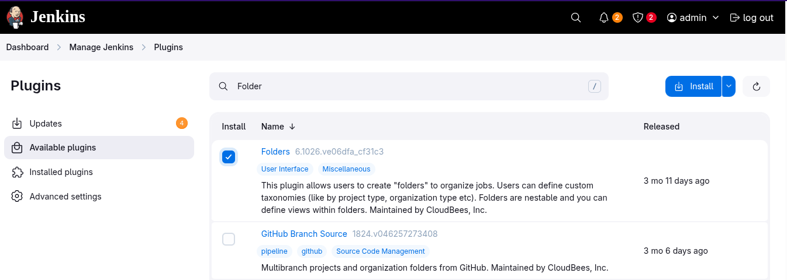
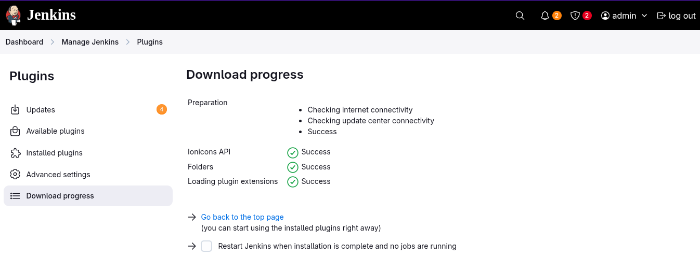
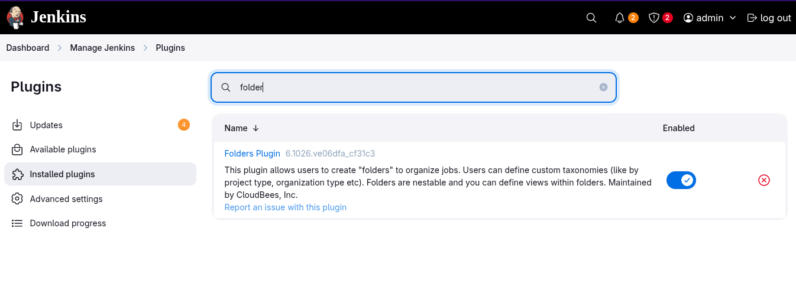
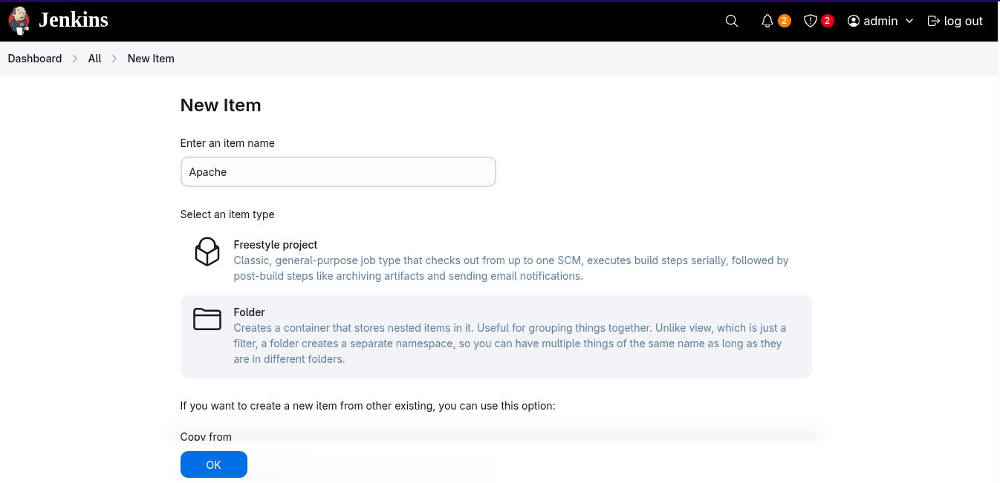
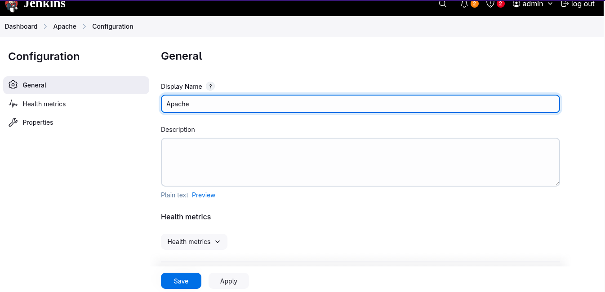
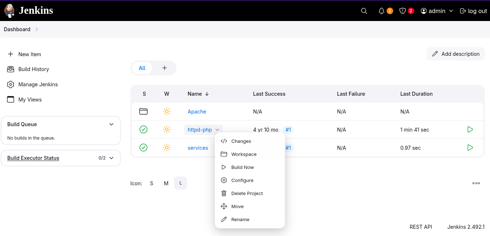
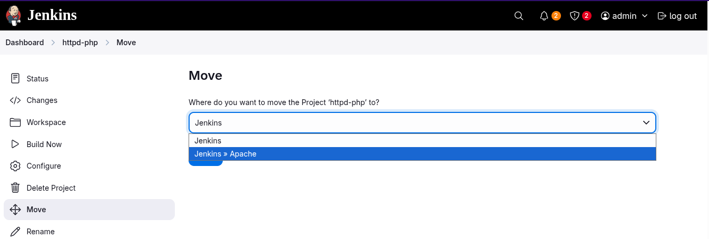
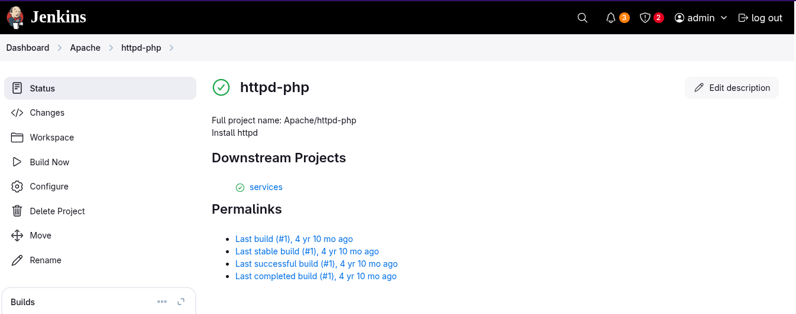
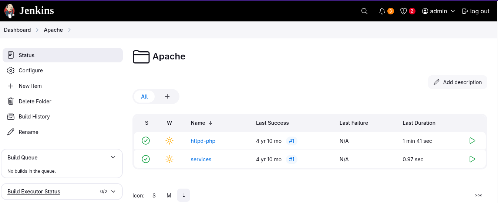

# Organize Jenkins Jobs with Folders

1. Access the `Jenkins` UI by clicking on the Jenkins button in the top bar. Log in using the credentials: username `admin` and password `Adm!n321`
2. Create a new folder named `Apache` within the Jenkins UI
3. Move the existing jobs `httpd-php` and `services` under the newly created `Apache` folder

**`Jenkins Version 2.492.1`**
---

### Install the `Folder` plugin
  
  
---

### Verify installed plugins
  
---

### Create a new folder named `Apache`
  
  
---

### Move the existing jobs `httpd-php` and `services` under the newly created `Apache` folder. Repeat for the job `services`
  
  
  
---

### Check the `Apache` folder
  