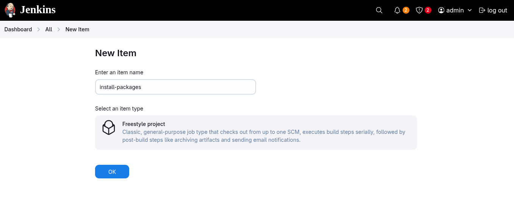
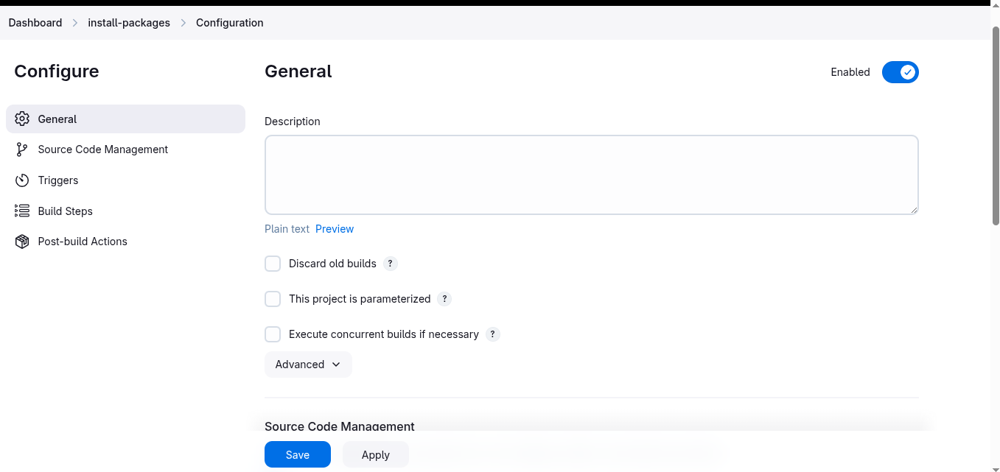
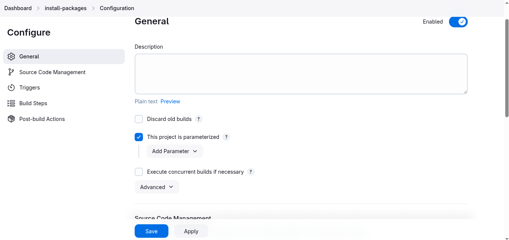
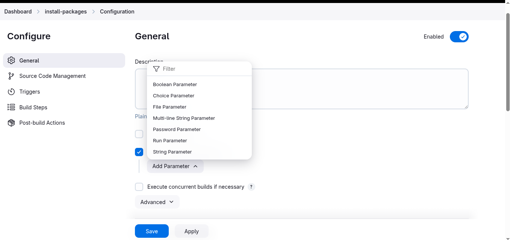
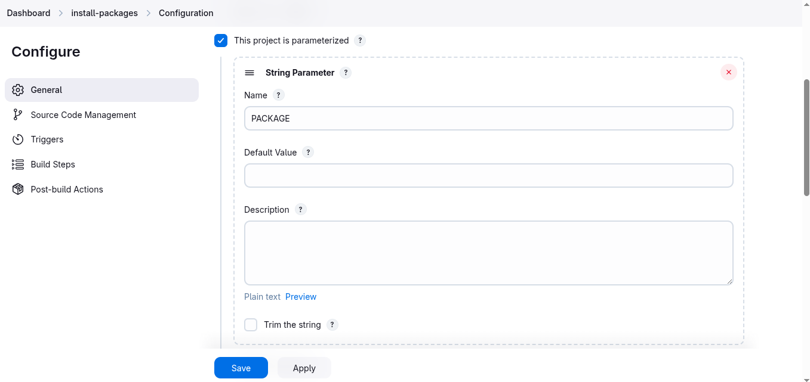
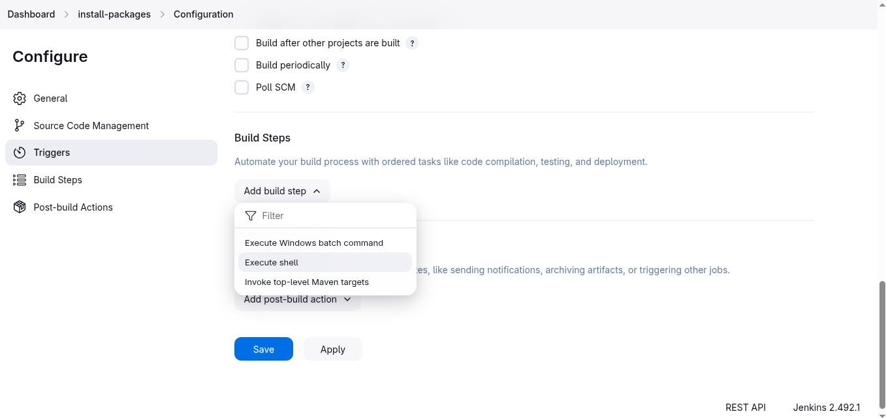
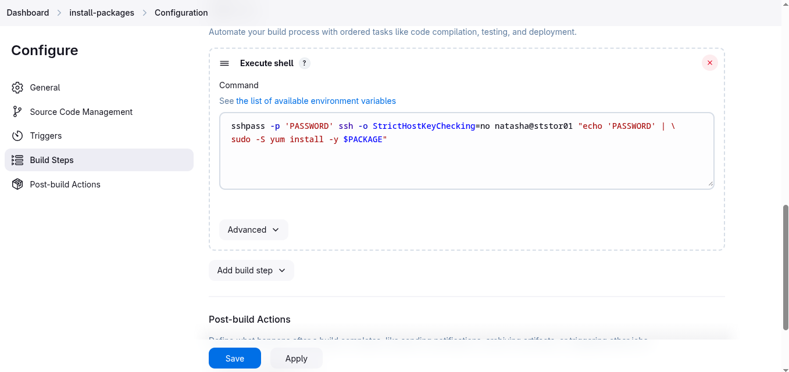
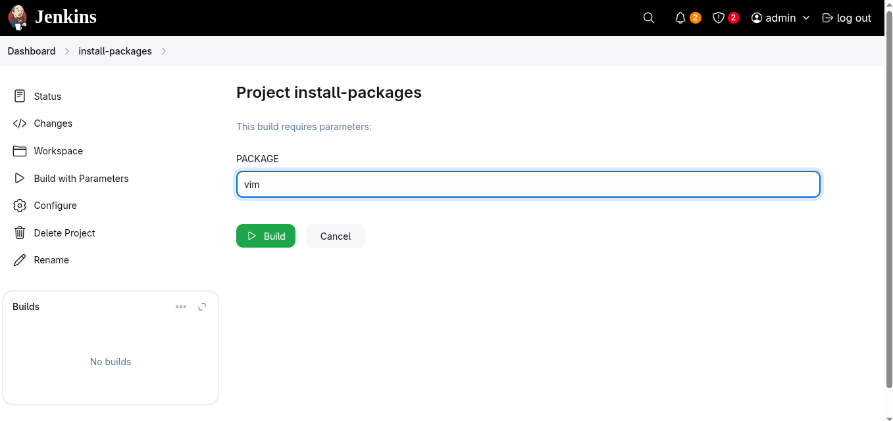
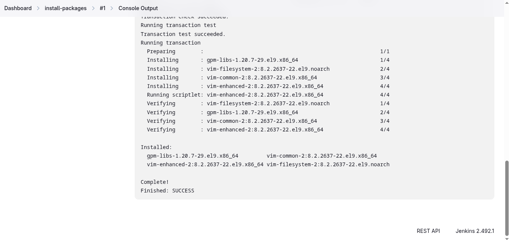

# Configure Jenkins Job for Package Installation

1. Access the `Jenkins` UI by clicking on the Jenkins button in the top bar. Log in using the credentials: username `admin` and password `Adm!n321`
2. Create a new Jenkins job named `install-packages` and configure it with the following specifications:
  - Add a string parameter named `PACKAGE`
  - Configure the job to install a package specified in the `$PACKAGE` parameter on the `storage server` within the `Stratos Datacenter`

**`Jenkins Version 2.492.1`**
---

### Create a new jobs `install-packages`
  
  
---

### Add parameter `PACKAGE`
  
  
  

### Configure build step
  
  ```bash
  sshpass -p 'PASSWORD' ssh -o StrictHostKeyChecking=no natasha@ststor01 "echo 'PASSWORD' | sudo -S yum install -y $PACKAGE"
  ```
  

### Test job
  
  

