# Jenkins level-1 Certificate

1. The Nautilus team wanted to set a custom welcome/system message for a new Jenkins server which will be a greeting basically to welcome new Jenkins users. They came up with a custom message as per details given below.
  - Add a system message `Welcome to KKE Labs` for the Jenkins server.

    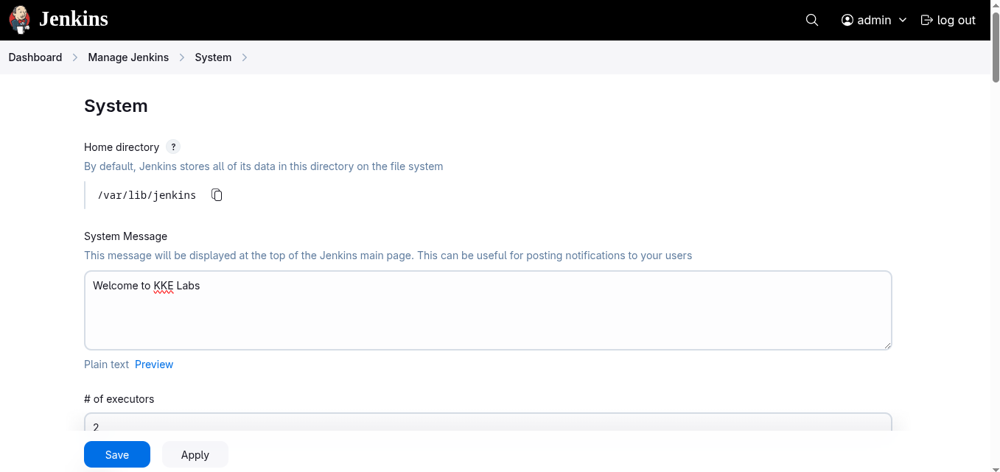
    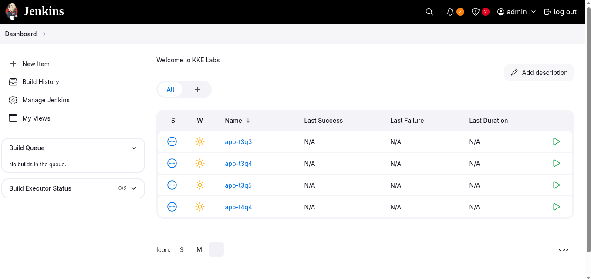

2. While testing the agent nodes configuration, there were some agent nodes added for testing purpose and now they need to be deleted. Below is the detail of one of the agent nodes which needs to be deleted/removed.
  - Delete the agent node named `Backup_Server` from Jenkins.

    **`There is only the Built-in Node`**

    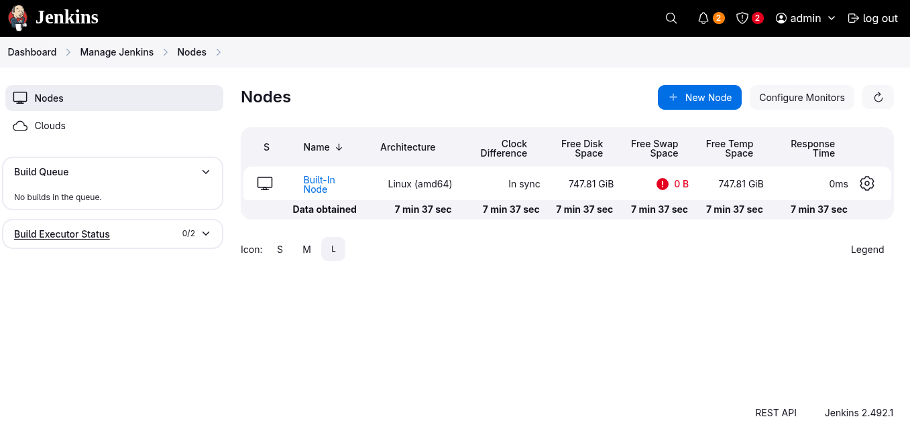

3. After setting up a new Jenkins server, the Nautilus team aimed to create and test some jobs to ensure everything is configured correctly. Currently, they have very basic requirements as outlined below.
  - Create a freestyle job named `app-job-t3q1`, add any sample code (bash commands or something) under this job.

    
    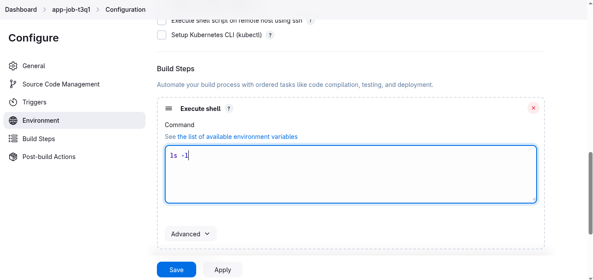
    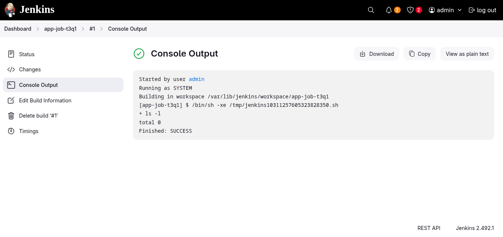

4. To manage the increasing number of jobs on the Jenkins server, the Nautilus team recognized the need to categorize them based on their nature, environment, etc. This categorisation would facilitate easier visualisation and organisation of the jobs. Consequently, similar to the views, the team intends to create a folder and relocate specific jobs accordingly.
  - Create a folder named `folder-t3q5`, and move the `job app-t3q5` under the same.

    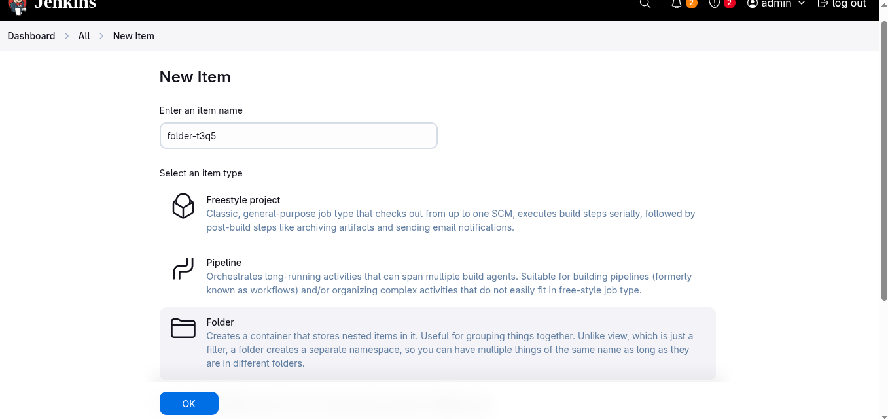
    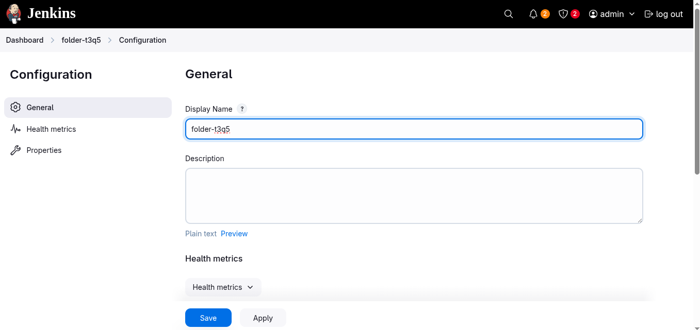
    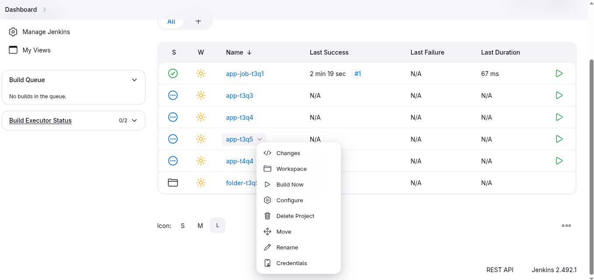
    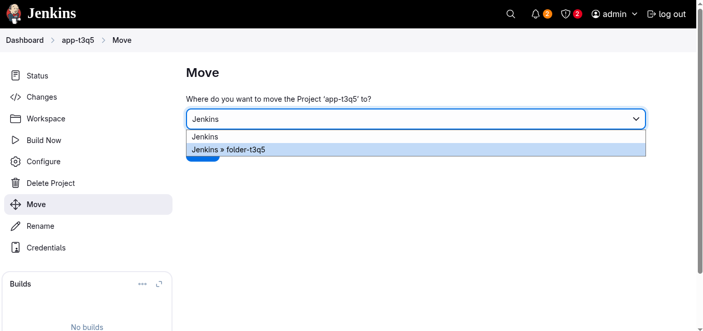
    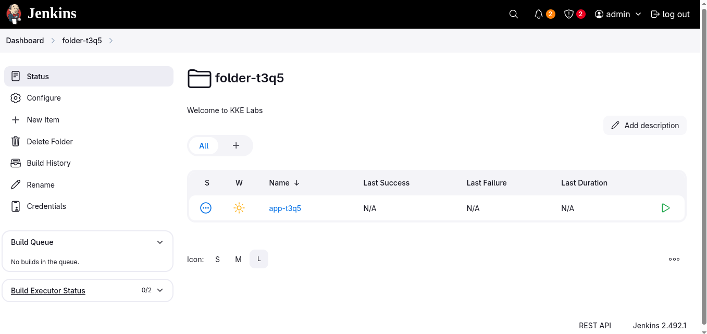

5. The Nautilus DevOps team is working on to configure a Jenkins server. They are working on to configuring a couple of pipelines and for that they need to install some plugins. Recently they have shared below requirements.
  - Install jenkins `junit` plugin. You might need to restart Jenkins service to install this plugin, so we recommend clicking on `Restart Jenkins when installation is complete and no jobs are running` on plugin installation/update page i.e `update centre`.
  - Click on the Jenkins button on the top bar to access the Jenkins UI. Login using username `admin` and `Adm!n321` password.

    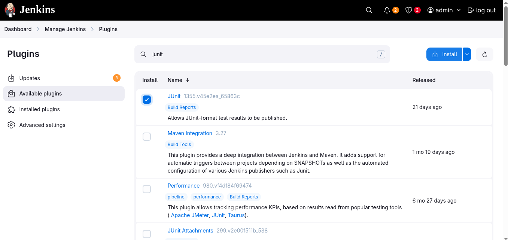
    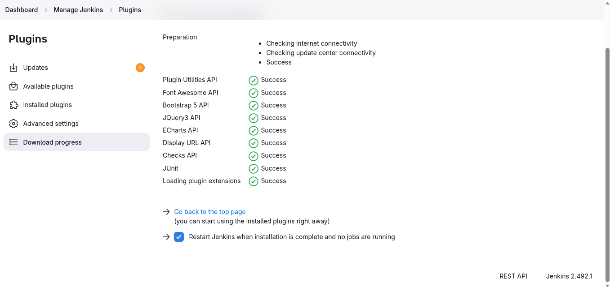
    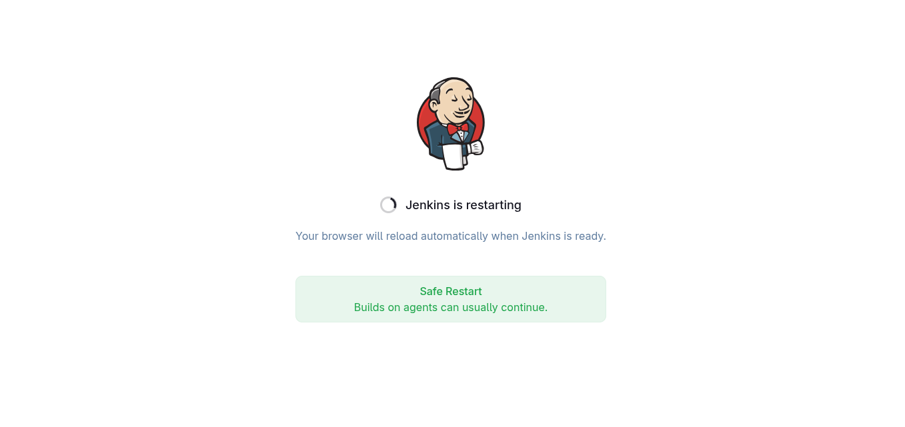
    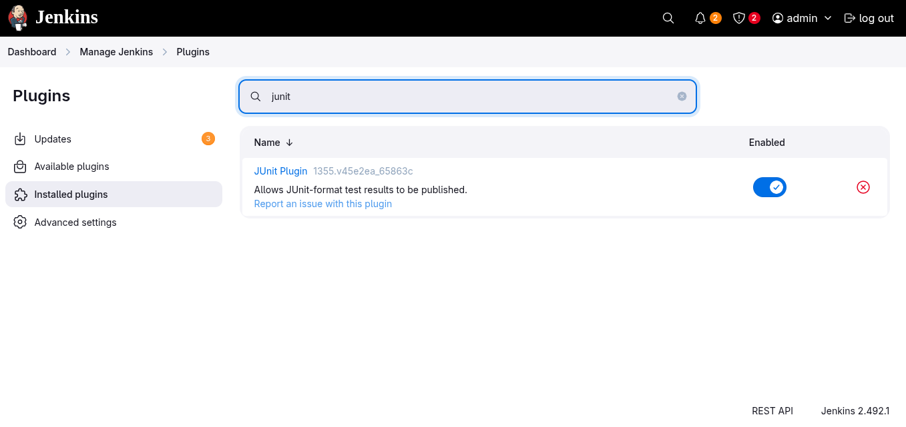

6. As the Nautilus DevOps team is working on to configure a Jenkins server. They are working on to configuring a couple of pipelines and for that they need to install some plugins. Recently they have shared below requirements.
  - Install `Splunk` Jenkins plugin.

    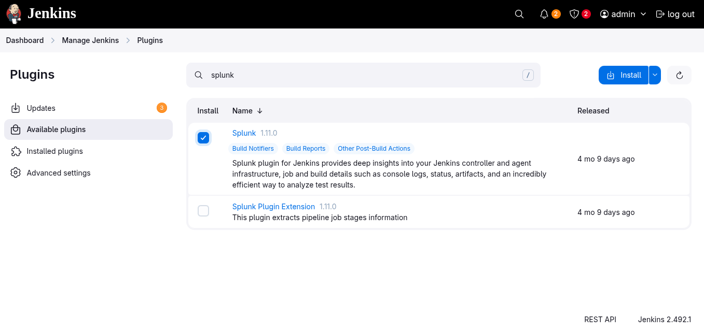
    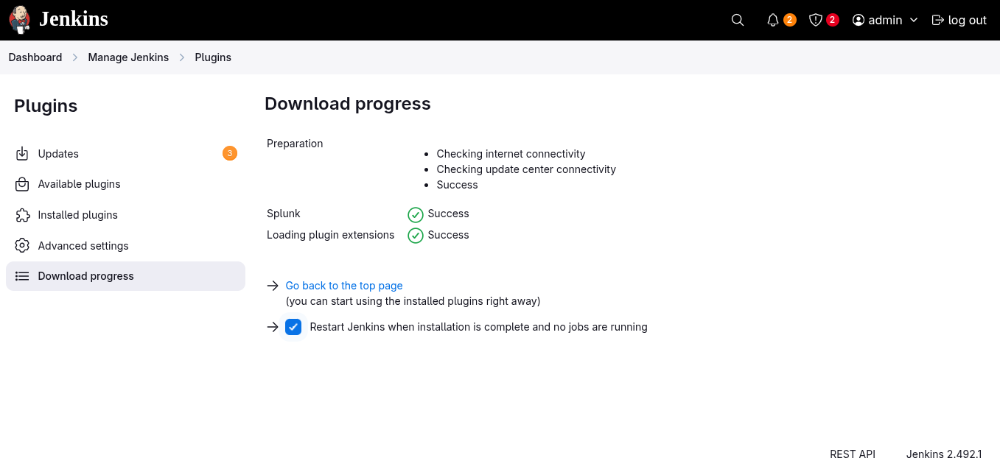
    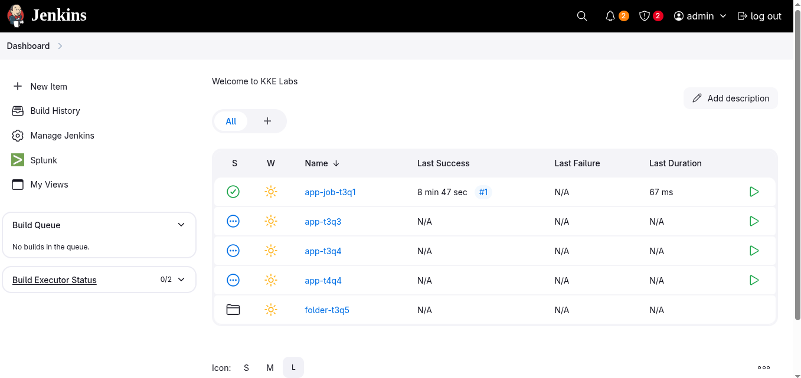

7. The Nautilus DevOps team is configuring user permissions to ensure they can perform necessary operations within the Jenkins server, such as job creation, updating, deletion, and Jenkins configuration updates. Below are the requirements they shared for global permissions:
  - Configure the permissions for Authenticated Users under Project based Matrix Authorization Strategy as below:
    * Agent: Configure
    * Job: Create
    * View: Read

    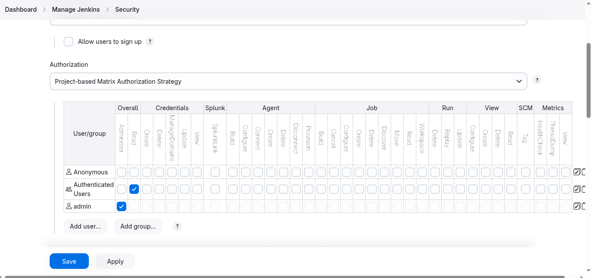
    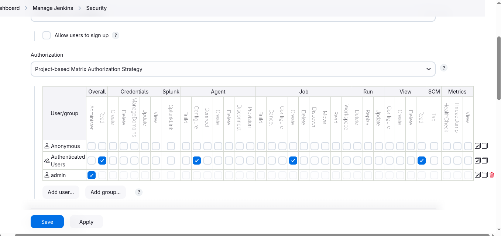

8. The Nautilus DevOps team was using new Jenkins server to test few jobs, so earlier they created few users. As now they are done with their testing so they want to delete one of the users they created earlier.
  - Delete the user `robt4q3`

    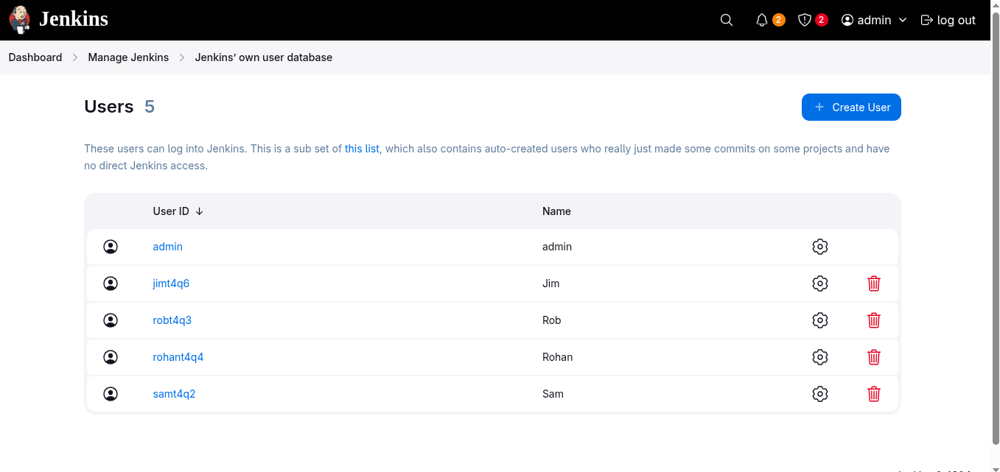
    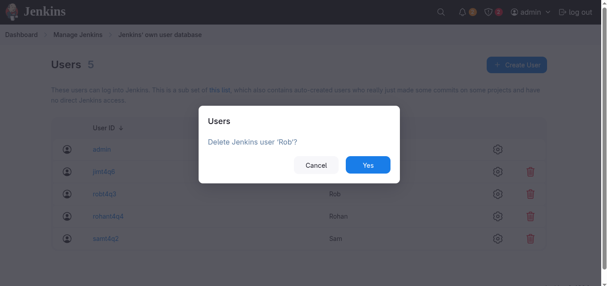