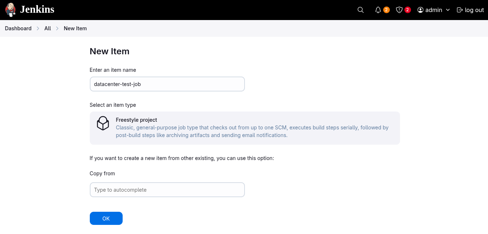
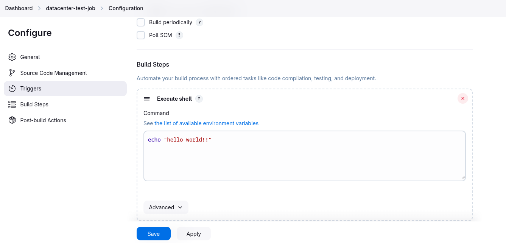
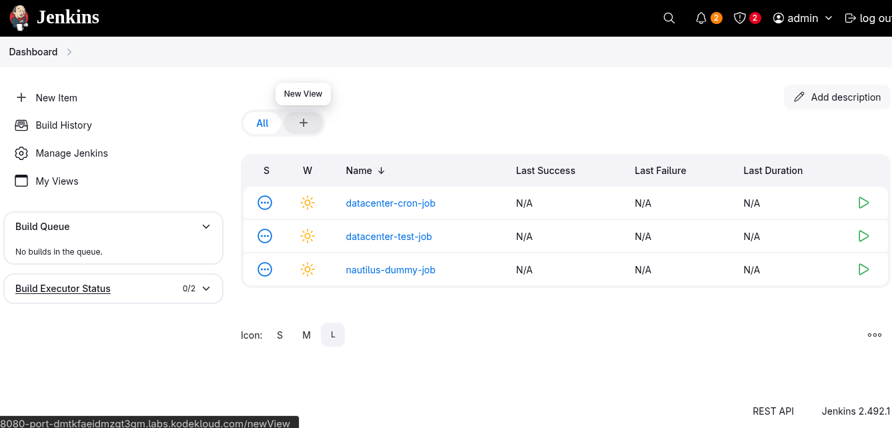
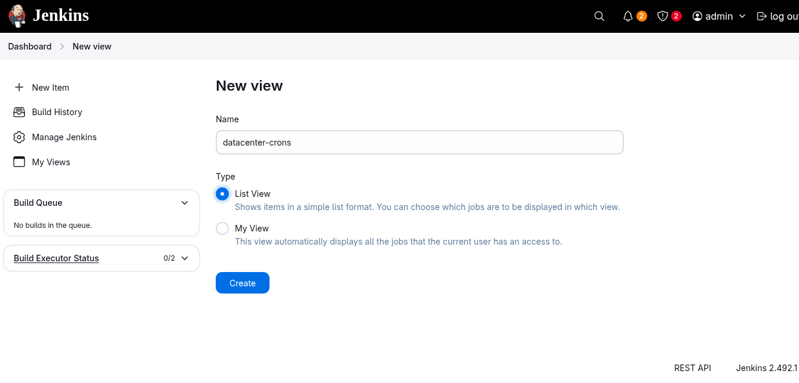
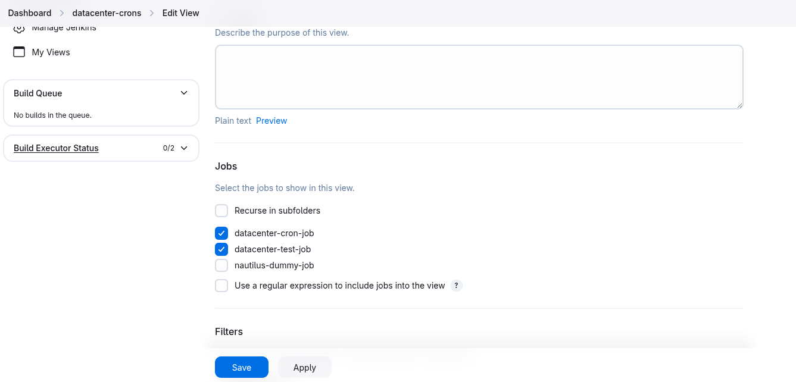
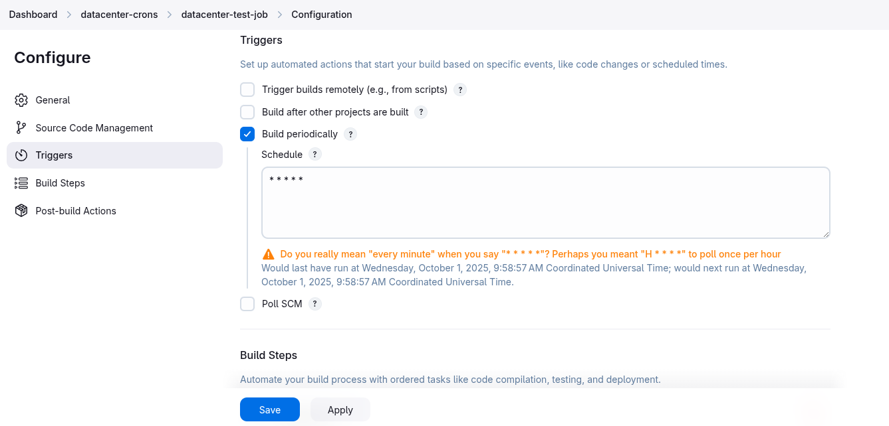
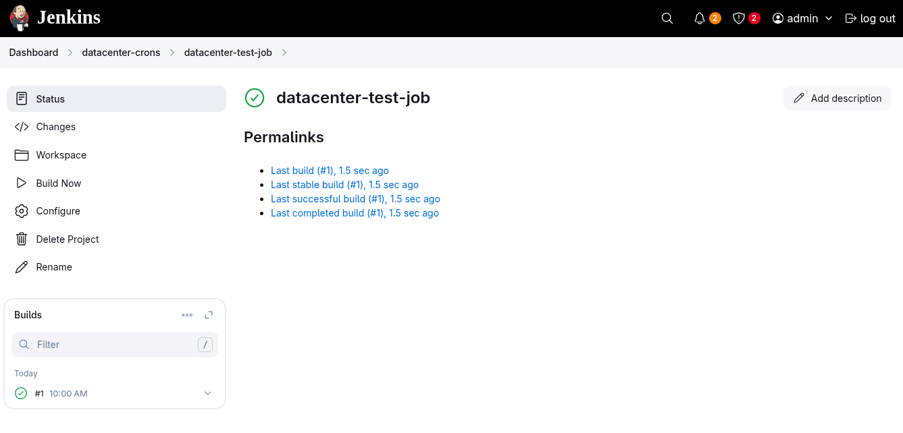

# # Jenkins Views

1. . Create a Jenkins job named `datacenter-test-job`.

2. Configure this job to run a simple bash command i.e `echo "hello world!!"`.

3. Create a view named `datacenter-crons` (it must be a `global` view of type `List View`) and make sure `datacenter-test-job` and `datacenter-cron-job` (which is already present on Jenkins) jobs are listed under this new view.

4. Schedule this newly created job to build periodically at `every minute` i.e `* * * * *` (`please make sure to use the cron expression exactly same how it is mentioned here`)

5. Make sure the job builds successfully.

**`Jenkins Version 2.492.1`**
---

### Create a new jobs `datacenter-test-job`
  
  
---

### Create a new view `datacenter-crons`
  
  
  
---

### Schedule the job 
  

### Verify the jobs builds successfully
  