# Jenkins Parameterized Builds

1. Create a **parameterized** job which should be named as **parameterized-job**

2. Add a **string** parameter named **Stage**; its default value should be **Build**.

3. Add a **choice** parameter named **env**; its choices should be **Development**, **Staging** and **Production**.

4. Configure job to execute a shell command, which should echo both parameter values (you are passing in the job).

5. Build the Jenkins job at least once with choice parameter value **Staging** to make sure it passes.

> Jenkins Version 2.492.1
---

### Create a new jobs **parameterized-job**
  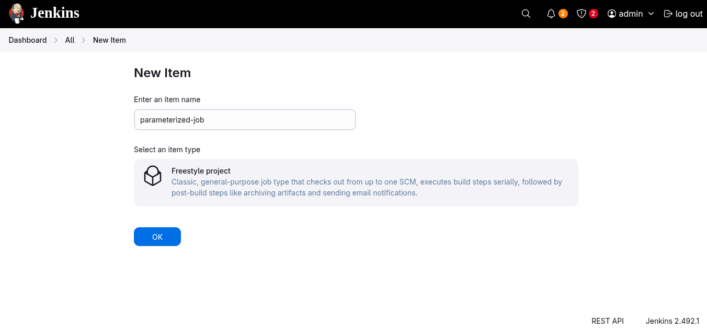
---

### Add parameters
  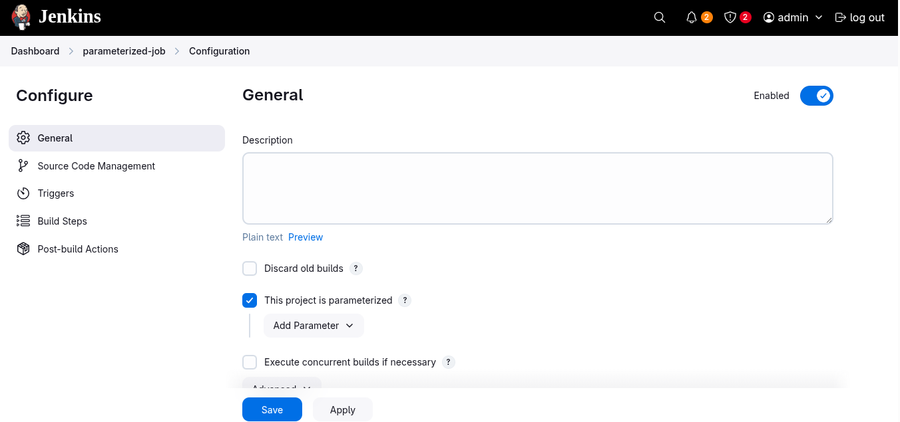
  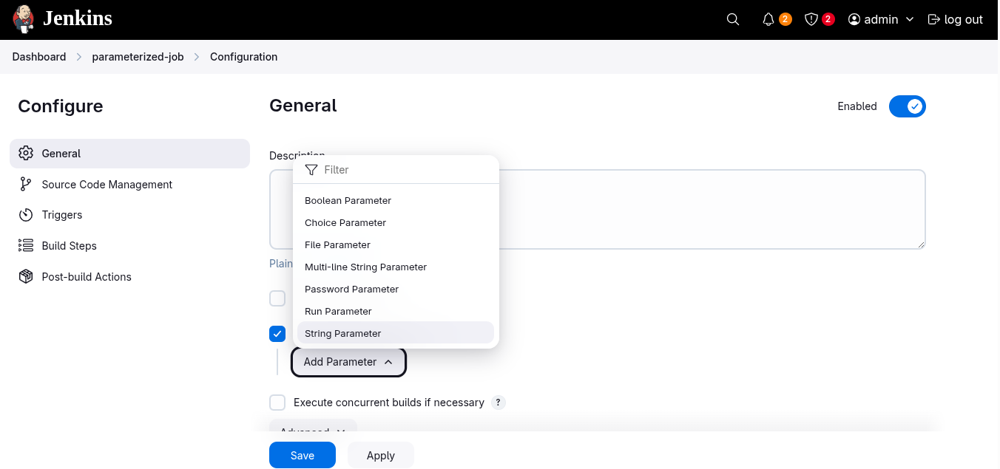
  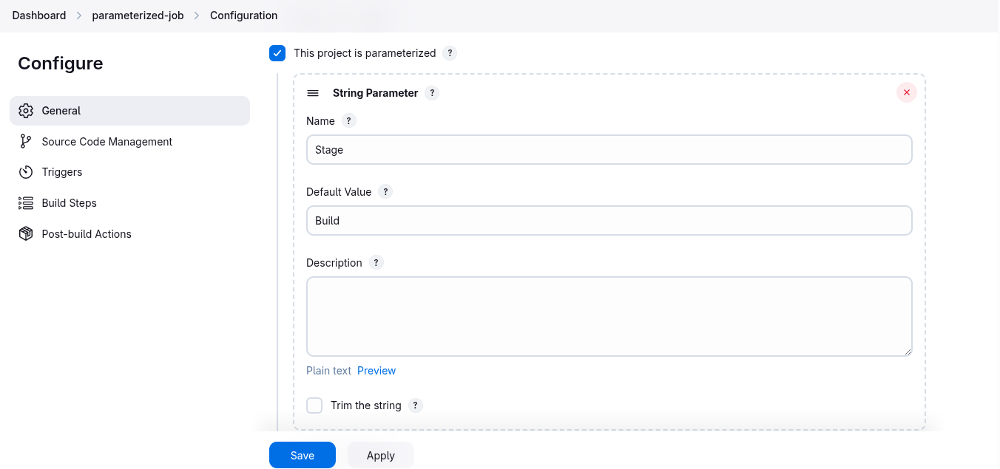
  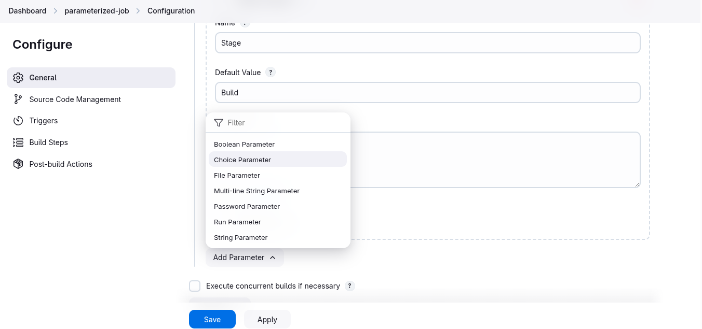
  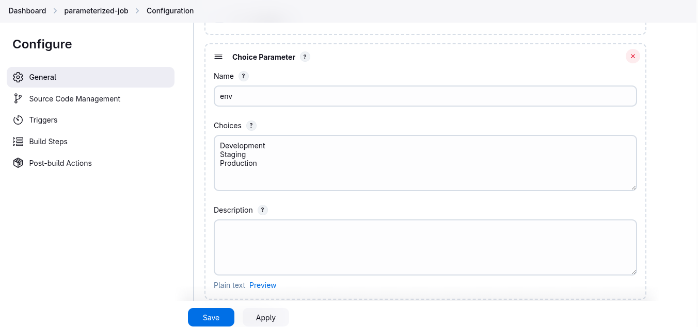
---

### Configure the Shell Command
  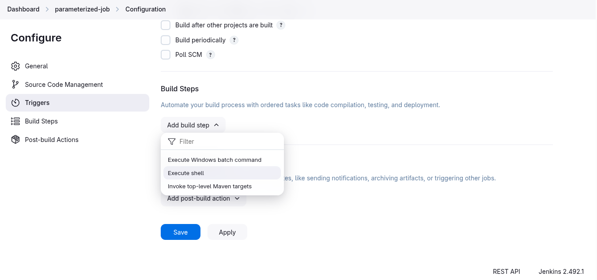
  ```sh
  echo "Stage parameter: $Stage"
  echo "Environment parameter: $env"
  ```
  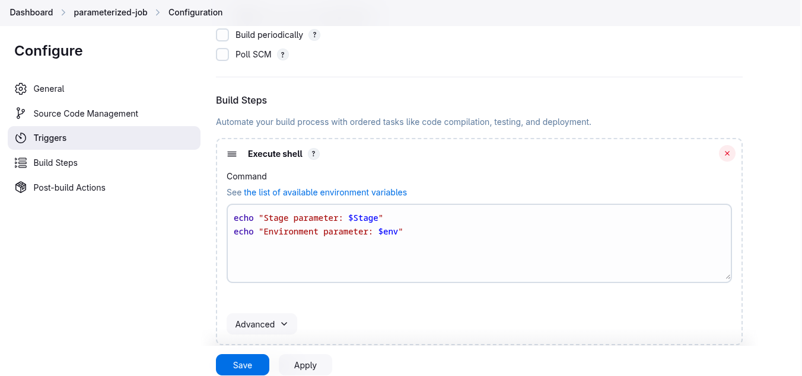

### Build the job
  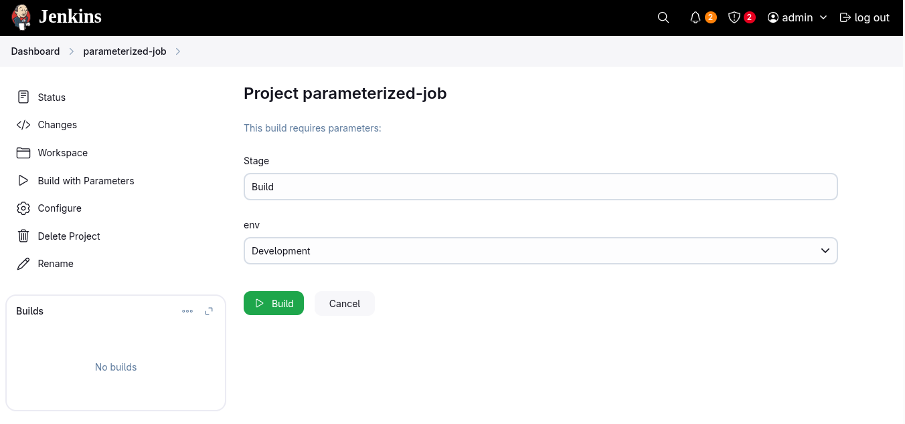

### Verify output
  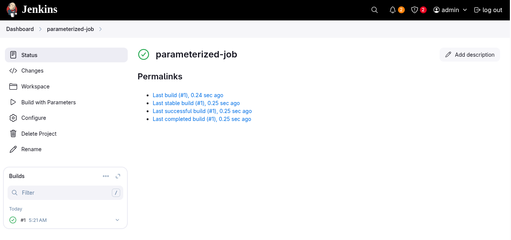
  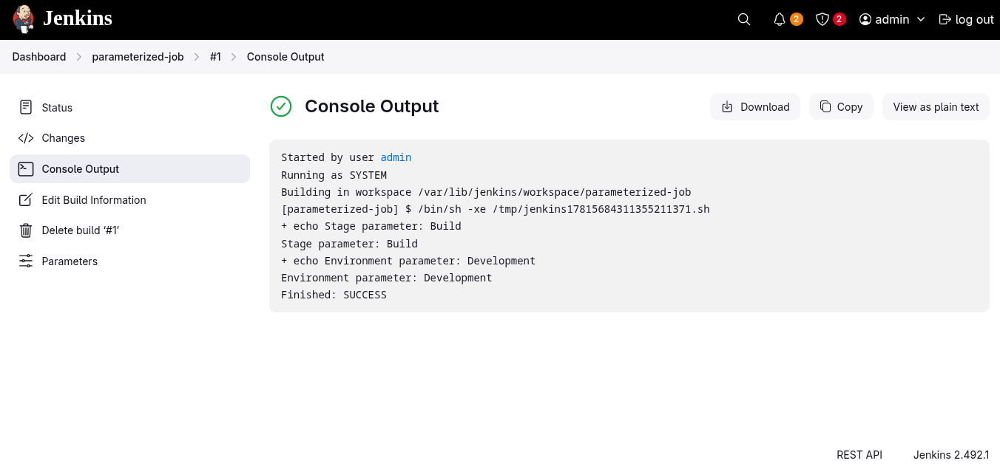


