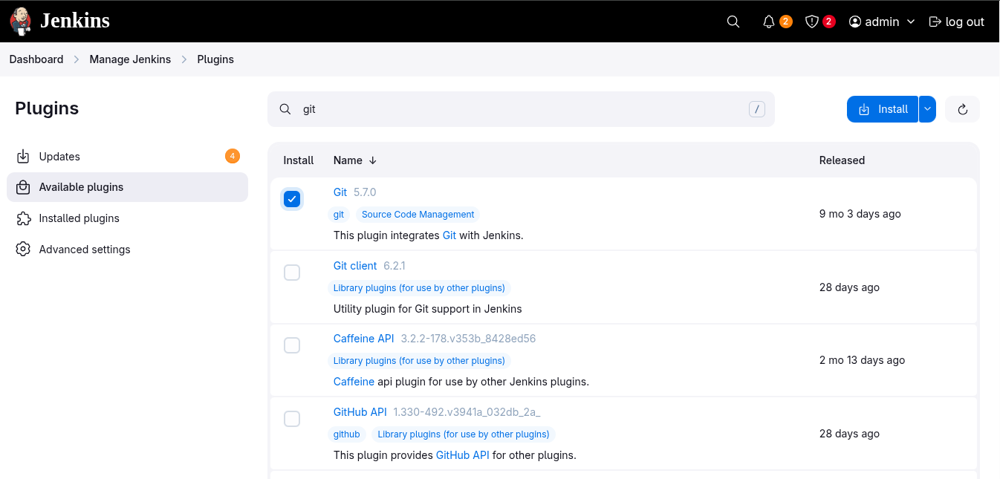
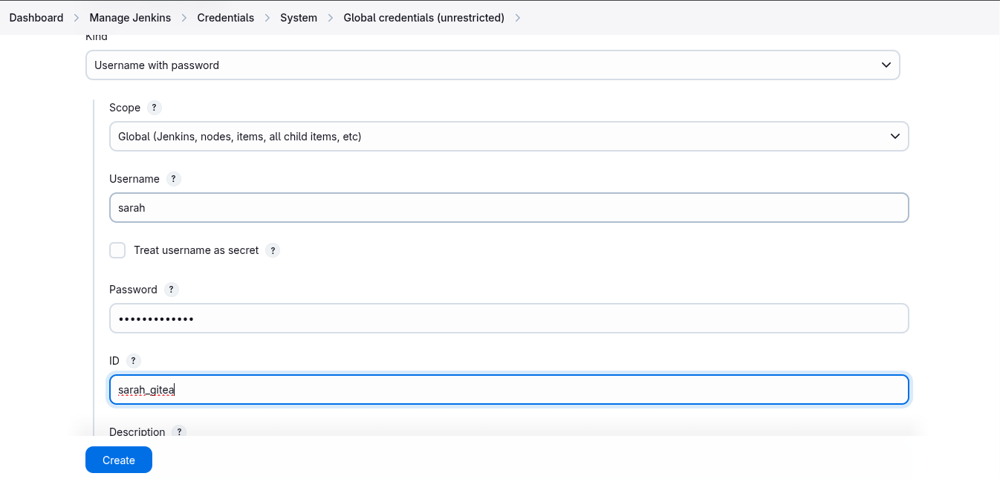

# Jenkins Workspaces

1. There is a Git repository named **web_app** on Gitea where developers are pushing their changes. It has three branches **version1**, **version2** and **version3** (excluding the master branch). You need not to make any changes in the repository.

2. Create a Jenkins job named **app-job**.

3. Configure this job to have a choice parameter named **Branch** with choices as given below:
  - **version1**
  - **version2**
  - **version3**

4. Configure the job to fetch changes from above mentioned Git repository and make sure it should fetches the changes from the respective branch which you are passing as a choice in the choice parameter while building the job. For example if you choose **version1** then it must fetch and deploy the changes from branch **version1**.

5. Configure this job to use custom workspace rather than a default workspace and custom workspace directory should be created under **/var/lib/jenkins** (for example **/var/lib/jenkins/version1**) location rather than under any sub-directory etc. The job should use a workspace as per the value you will pass for Branch parameter while building the job. For example if you choose **version1** while building the job then it should create a workspace directory called **version1** and should fetch Git repository etc within that directory only.

6. Configure the job to deploy code (fetched from Git repository) on storage server (in Stratos DC) under **/var/www/html** directory. Since its a shared volume.

7. You can access the website by clicking on **App** button.

> Jenkins Version 2.492.1
---

### Create a new jobs **app-job**
  
---

### Add parameters
  
  
  
---

### Install Git plugin
  
  
  
  
  
  
---

### Create Gitea credentials
  
  
  
---

### Configure Source Code Management (Gitea)
  
---

### Configure Dynamic Custom Workspace
  
  ```bash
  /var/lib/jenkins/${Branch}
  ```
  
---

### Configure Build Step
  
  ```bash
  #!/bin/bash
  set -e

  echo "Deploying branch ${Branch} from workspace ${WORKSPACE}"

  REMOTE_USER="natasha"
  REMOTE_HOST="ststor01"
  REMOTE_PASS="password"
  REMOTE="${REMOTE_USER}@${REMOTE_HOST}"


  sshpass -p "${REMOTE_PASS}" ssh -o StrictHostKeyChecking=no "${REMOTE}" \
    "echo '${REMOTE_PASS}' | sudo -S rm -rf /var/www/html/*"

  sshpass -p "${REMOTE_PASS}" scp -o StrictHostKeyChecking=no -r ${WORKSPACE}/* "${REMOTE}:/var/www/html/"
  ```
  
---

### Test the Job
  
  
  