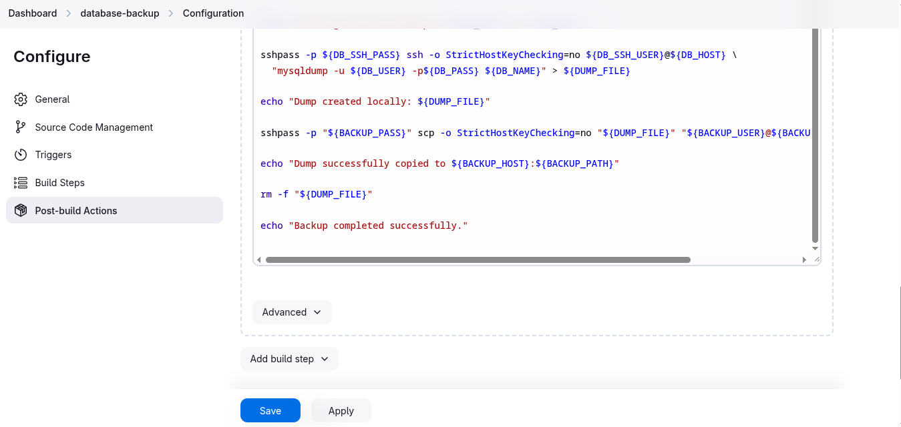

# Jenkins Database Backup Job

1. Create a Jenkins job named **database-backup**.

2. Configure it to take a database dump of the **kodekloud_db01** database present on the Database server in Stratos Datacenter, the database user is **kodekloud_roy** and password is **asdfgdsd**.

3. The dump should be named in **db_$(date +%F).sql** format, where **date +%F** is the current date.

4. Copy the **db_$(date +%F).sql** dump to the Backup Server under location **/home/clint/db_backups**.

5. Further, schedule this job to run periodically at **`*/10 * * * *`** (please use this exact schedule format).

> Jenkins Version 2.492.1
---

### Create a new jobs **database-backup**
  
---

### Schedule the job
  
  
---

### Configure Build Step
  

<details>
<summary>backup-job</summary>

```bash
#!/bin/bash
set -e

DB_USER="kodekloud_roy"
DB_PASS="asdfgdsd"
DB_NAME="kodekloud_db01"
DB_HOST="stdb01"
DB_SSH_USER="peter"
DB_SSH_PASS="peter"

BACKUP_USER="clint"
BACKUP_HOST="stbkp01"
BACKUP_PASS="clint"
BACKUP_PATH="/home/clint/db_backups"

DUMP_FILE="db_$(date +%F).sql"

echo "Starting database backup for $DB_NAME from $DB_HOST..."

sshpass -p ${DB_SSH_PASS} ssh -o StrictHostKeyChecking=no ${DB_SSH_USER}@${DB_HOST} \
  "mysqldump -u ${DB_USER} -p${DB_PASS} ${DB_NAME}" > ${DUMP_FILE}

echo "Dump created locally: ${DUMP_FILE}"

sshpass -p "${BACKUP_PASS}" scp -o StrictHostKeyChecking=no "${DUMP_FILE}" "${BACKUP_USER}@${BACKUP_HOST}:${BACKUP_PATH}/"

echo "Dump successfully copied to ${BACKUP_HOST}:${BACKUP_PATH}"

rm -f "${DUMP_FILE}"

echo "Backup completed successfully."
```
</details>

  
---

### Verify and Test
  * Check that no backup file exists before the job runs, review the console output, and confirm the verification results
  
  
  