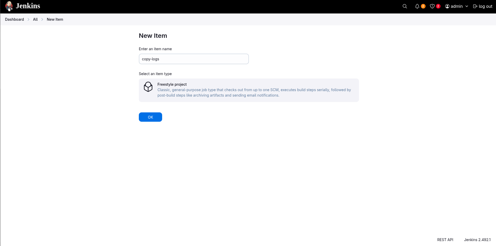
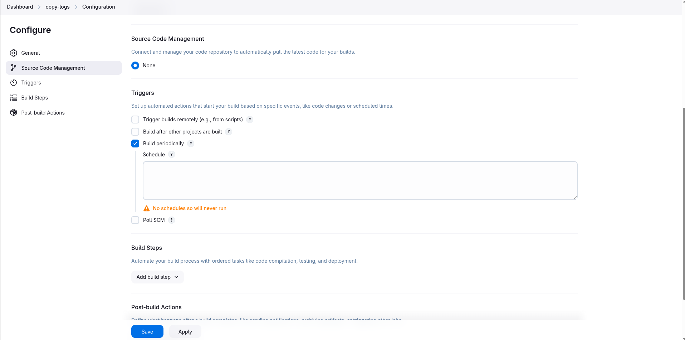
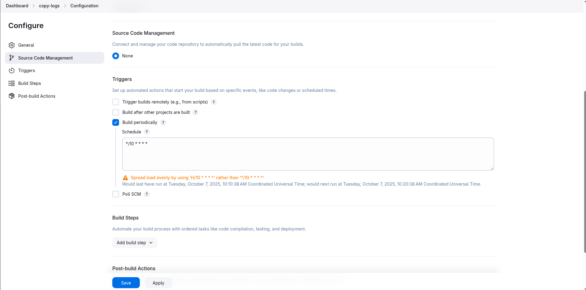
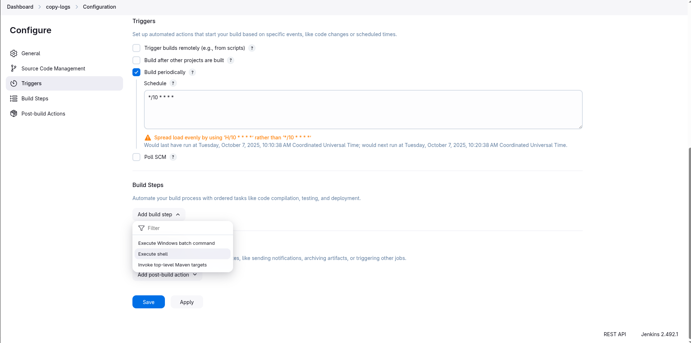
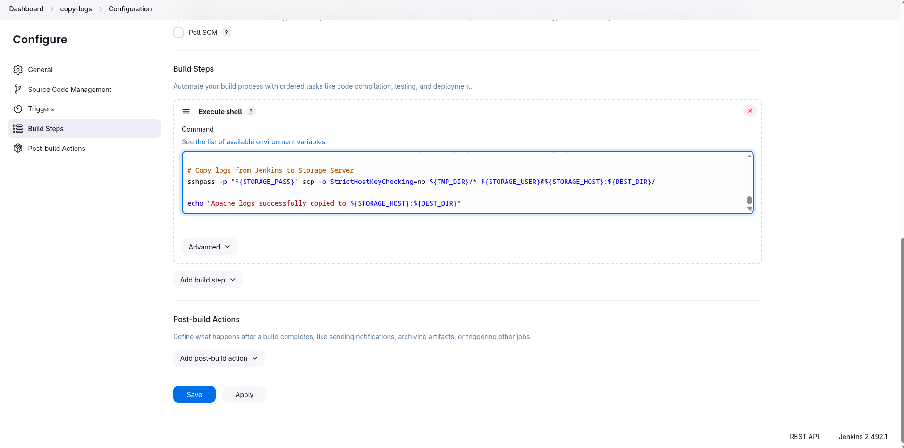
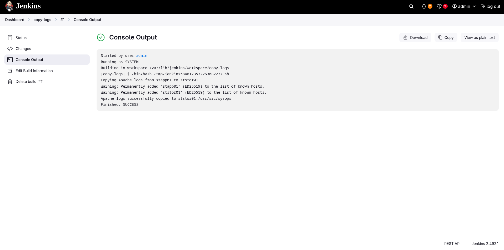
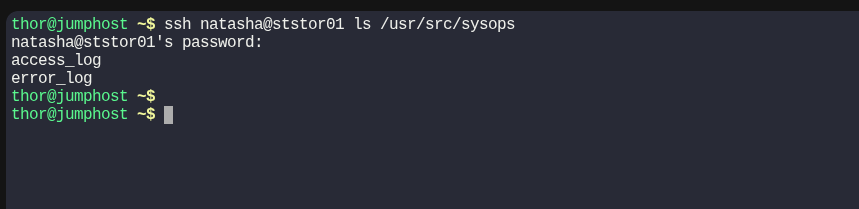

# Jenkins Scheduled Jobs

1. Create a Jenkins jobs named **copy-logs**.

2. Configure it to periodically build **every 10 minutes** to copy the Apache logs (**both access_log and error_logs**) from **App Server 1** (**from default logs location**) to location **/usr/src/sysops** on **Storage Server**


> Jenkins Version 2.492.1
---

### Create a new jobs **copy-logs**
  
---

### Schedule the job
  
  
---

### Configure Build Step
  

<details>
<summary>copy-logs</summary>

```bash
#!/bin/bash
set -e

# App server details
APP_USER="tony"
APP_HOST="app01"
APP_PASS="tony"

# Storage server details
STORAGE_USER="natasha"
STORAGE_HOST="ststor01"
STORAGE_PASS="natasha"

# Apache log locations (on App Server)
ACCESS_LOG="/var/log/httpd/access_log"
ERROR_LOG="/var/log/httpd/error_log"

# Destination directory on Storage Server
DEST_DIR="/usr/src/sysops"

echo "Copying Apache logs from ${APP_HOST} to ${STORAGE_HOST}..."

# Create a temporary directory on Jenkins to hold the logs
TMP_DIR="/tmp/apache_logs"
mkdir -p "${TMP_DIR}"

# Copy logs from App Server to Jenkins
sshpass -p "${APP_PASS}" scp -o StrictHostKeyChecking=no ${APP_USER}@${APP_HOST}:${ACCESS_LOG} ${TMP_DIR}/
sshpass -p "${APP_PASS}" scp -o StrictHostKeyChecking=no ${APP_USER}@${APP_HOST}:${ERROR_LOG} ${TMP_DIR}/

# Copy logs from Jenkins to Storage Server
sshpass -p "${STORAGE_PASS}" scp -o StrictHostKeyChecking=no ${TMP_DIR}/* ${STORAGE_USER}@${STORAGE_HOST}:${DEST_DIR}/

echo "Apache logs successfully copied to ${STORAGE_HOST}:${DEST_DIR}"

```
</details>

  
---

### Verify and Test
  
  