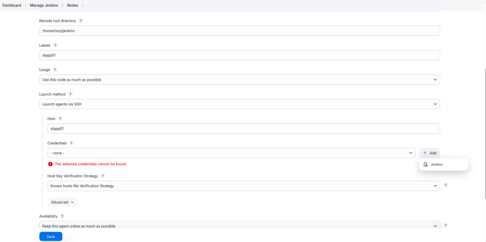

# Jenkins Slave Nodes

1. Add all app servers as SSH build agent/slave nodes in Jenkins. Slave node name for **app server 1**, **app server 2** and **app server 3** must be **App_server_1**, **App_server_2**, **App_server_3** respectively.

2. Add labels as below:
  - **App_server_1 : stapp01**
  - **App_server_2 : stapp02**
  - **App_server_3 : stapp03**

3. Remote root directory for **App_server_1** must be **/home/tony/jenkins**, for **App_server_2** must be **/home/steve/jenkins** and for **App_server_3** must be **/home/banner/jenkins**.

4. Make sure slave nodes are online and working properly.

> Jenkins Version 2.492.1
---

### Install SSH Build Agents Plugin
  
  
  
---

### Add Agents
  
  
  
  
  
  
  
  
  
  
  
  
  
  
  
  
  
  
---

### Install & Verify Java on the Remote Agent Nodes
```bash
sshpass -p "steve" ssh -o StrictHostKeyChecking=no steve@stapp02 "echo 'steve' | sudo -S dnf install -y java-17-openjdk"
sshpass -p "steve" ssh -o StrictHostKeyChecking=no steve@stapp02 "rpm -qa | grep java"

sshpass -p "banner" ssh -o StrictHostKeyChecking=no banner@stapp03 "echo 'banner' | sudo -S dnf install -y java-17-openjdk"
sshpass -p "banner" ssh -o StrictHostKeyChecking=no banner@stapp03 "rpm -qa | grep java"

```
---

### Repeat for the other two nodes
  
  
  
  
---

### Verification
  