# Jenkins Project Security

1. There is an existing Jenkins job named **Packages**, there are also two existing Jenkins users named **sam** with password **sam@pass12345** and **rohan** with password **rohan@pass12345**

2. Grant permissions to these users to access **Packages** job as per details mentioned below:
  - a. Make sure to select **Inherit permissions from parent ACL** under inheritance strategy for granting permissions to these users.
  - b. Grant mentioned permissions to **sam** user : **build**, **configure** and **read**.
  - c. Grant mentioned permissions to **rohan** user : **build**, **cancel**, **configure**, **read**, **update** and **tag**

> Jenkins Version 2.492.1
---

### Install Matrix Authorization Strategy Plugin
  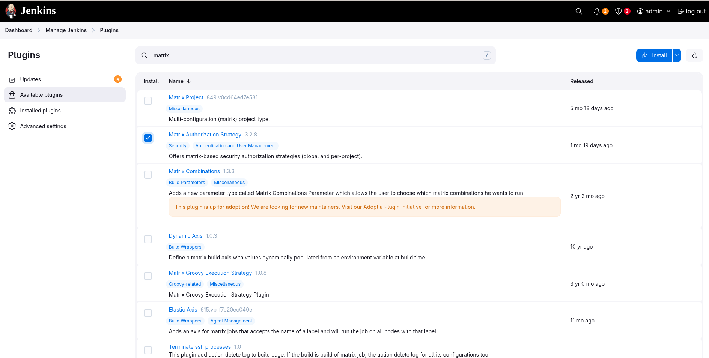
  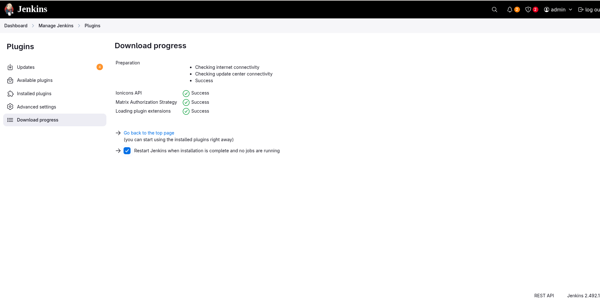
  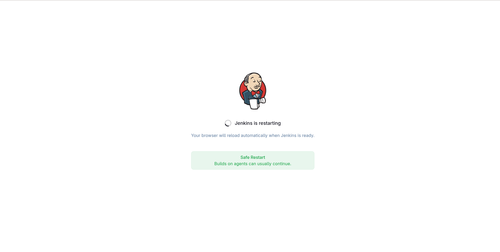
  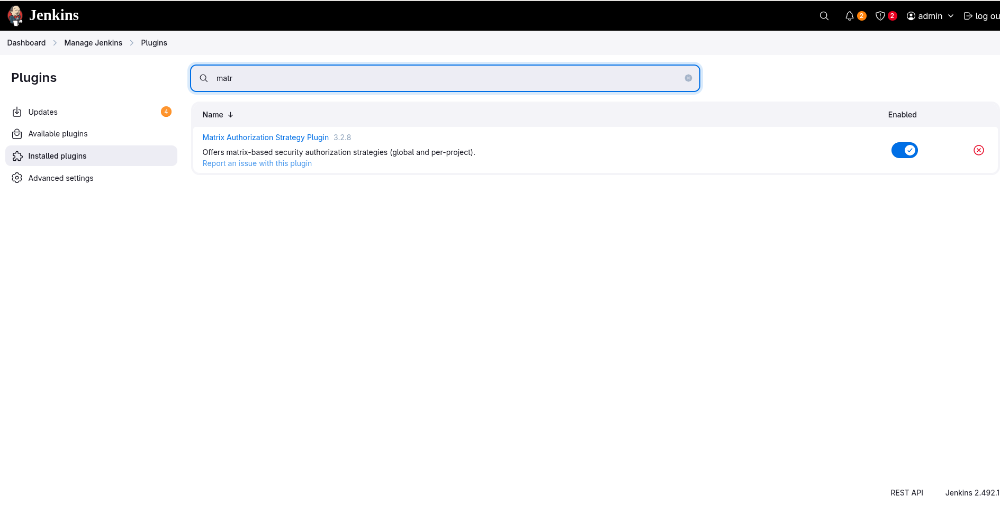
---

### Enable Project-based Matrix Authorization
  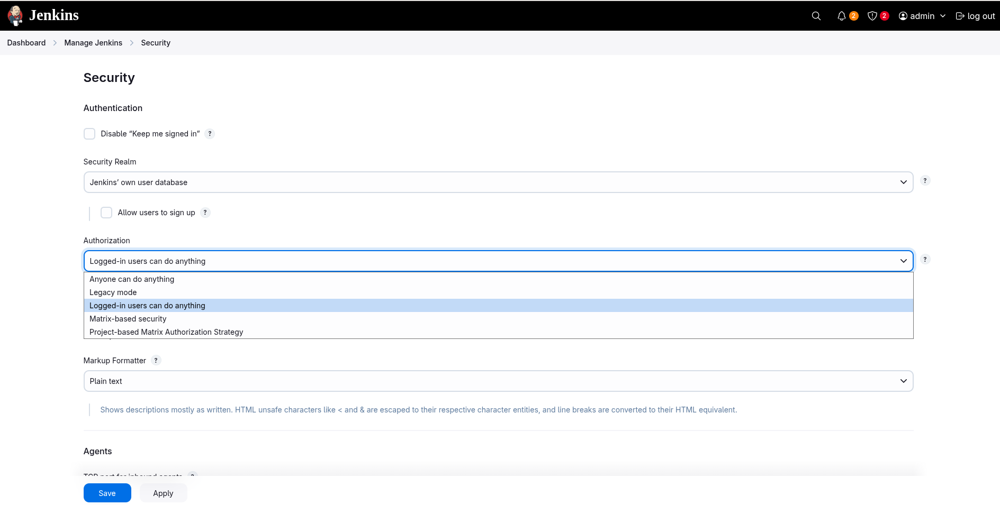
  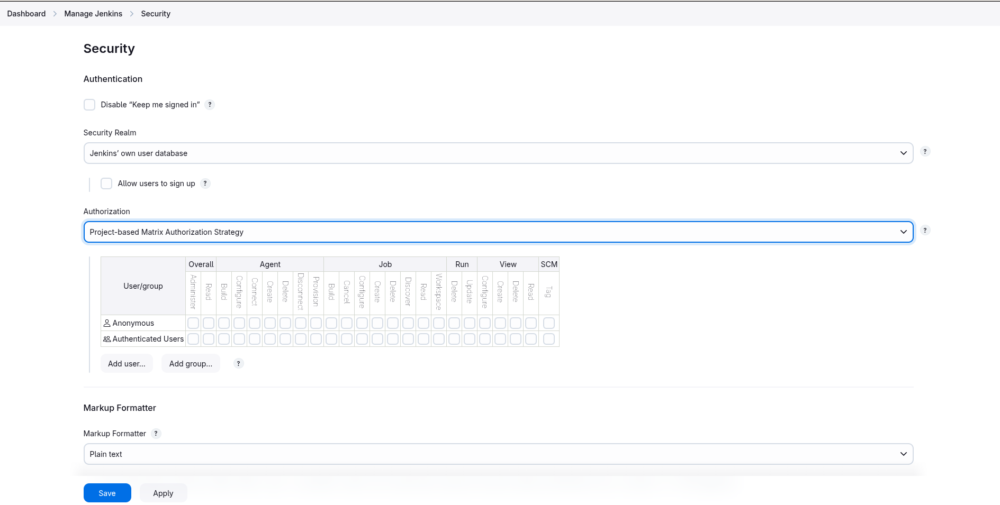
  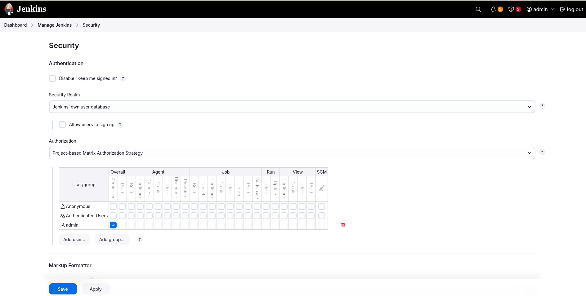
  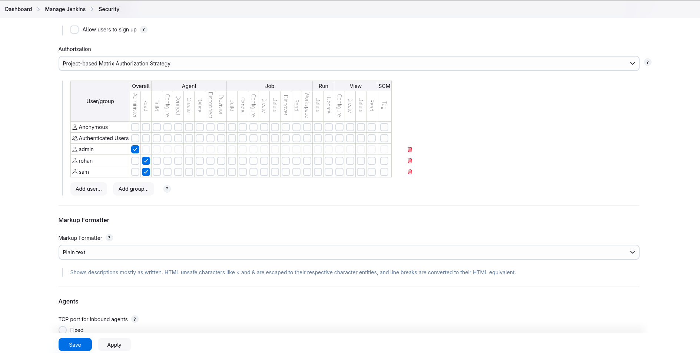
---

### Configure the Packages job
  * Check the box to Enable project-based security and select **Inherit permissions from parent ACL**
  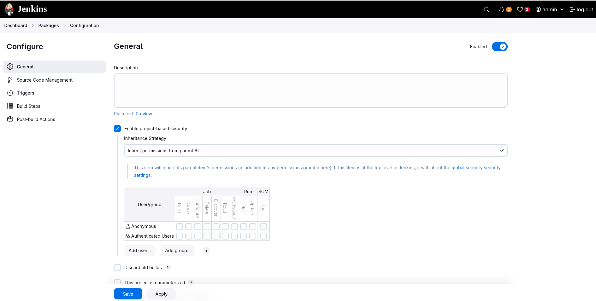
  * Add user and grant the required permissions
  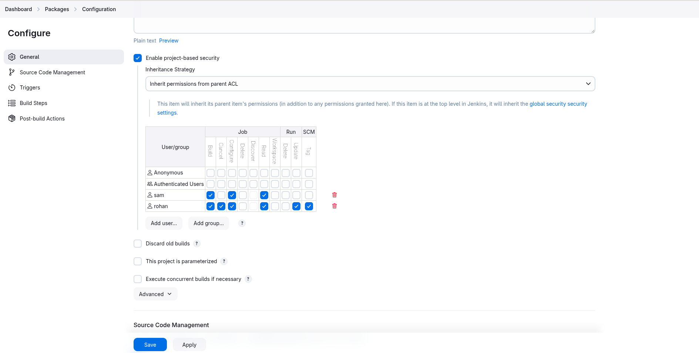
---

### Test login as sam
  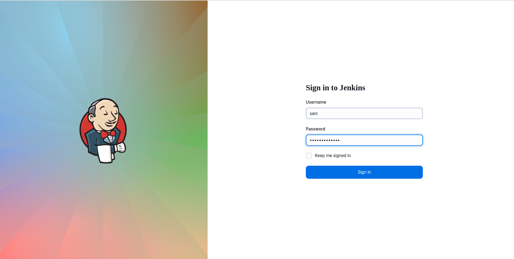
  
  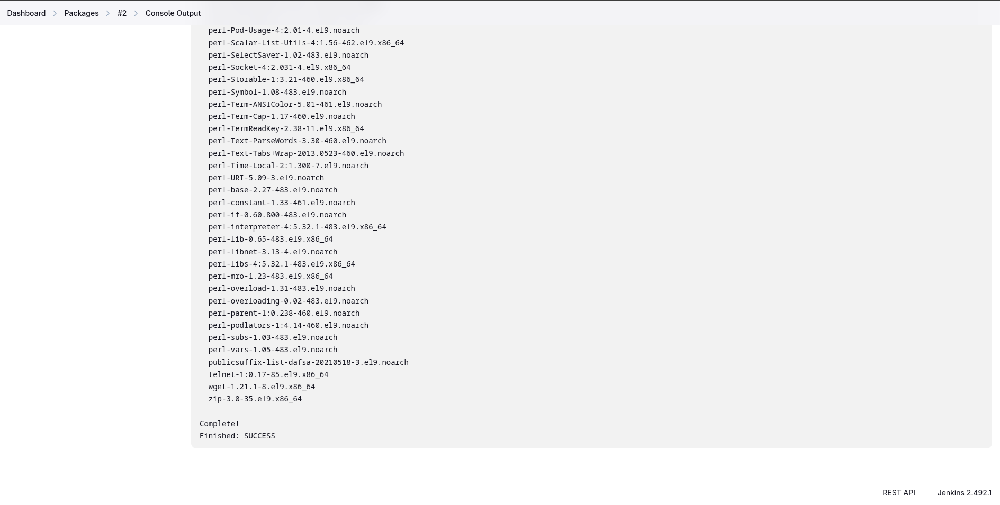
  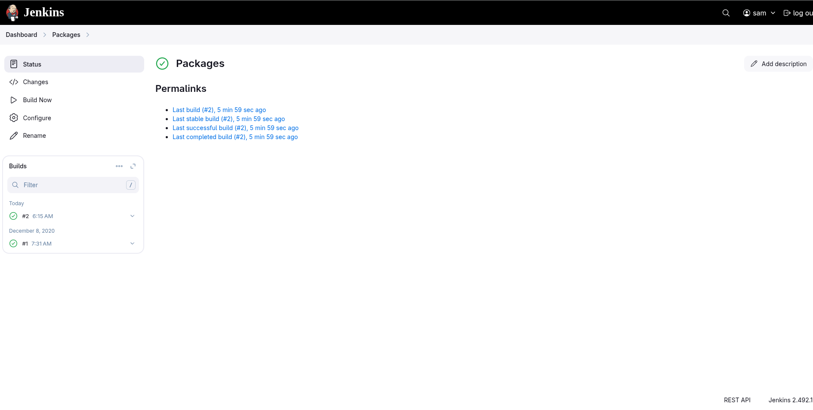
---
