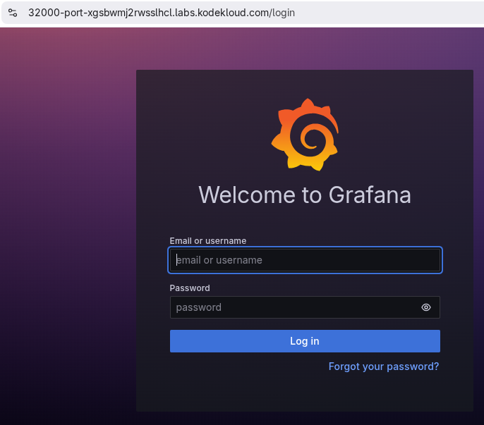

# Deploy Grafana on Kubernetes Cluster

1. Create a deployment named **grafana-deployment-xfusion** using any grafana image for Grafana app. Set other parameters as per your choice.

2. Create **NodePort** type service with nodePort **32000** to expose the app

> You need not to make any configuration changes inside the Grafana app once deployed, just make sure you are able to access the Grafana login page.

[Doc - Deploy Grafana on Kubernetes](https://grafana.com/docs/grafana/latest/setup-grafana/installation/kubernetes/)

<details>
<summary>grafana.yaml</summary>
        
```yaml
apiVersion: apps/v1
kind: Deployment
metadata:
  labels:
    app: grafana
  name: grafana-deployment-xfusion
spec:
  selector:
    matchLabels:
      app: grafana
  template:
    metadata:
      labels:
        app: grafana
    spec:
      securityContext:
        fsGroup: 472
        supplementalGroups:
          - 0
      containers:
        - name: grafana
          image: grafana/grafana:latest
          imagePullPolicy: IfNotPresent
          ports:
            - containerPort: 3000
              name: http-grafana
              protocol: TCP
          readinessProbe:
            failureThreshold: 3
            httpGet:
              path: /robots.txt
              port: 3000
              scheme: HTTP
            initialDelaySeconds: 10
            periodSeconds: 30
            successThreshold: 1
            timeoutSeconds: 2
          livenessProbe:
            failureThreshold: 3
            initialDelaySeconds: 30
            periodSeconds: 10
            successThreshold: 1
            tcpSocket:
              port: 3000
            timeoutSeconds: 1
          resources:
            requests:
              cpu: 250m
              memory: 750Mi
          volumeMounts:
            - mountPath: /var/lib/grafana
              name: grafana-pv
      volumes:
        - name: grafana-pv
          emptyDir: {}
---
apiVersion: v1
kind: Service
metadata:
  name: grafana
spec:
  ports:
    - port: 3000
      protocol: TCP
      targetPort: http-grafana
      nodePort: 32000
  selector:
    app: grafana
  sessionAffinity: None
  type: NodePort
```
</details>

```bash
kubectl apply -f grafana.yaml

kubectl get all
```

<details>
<summary>outputs</summary>

  #### kubectl apply -f grafana.yaml 
    deployment.apps/grafana-deployment-xfusion created
    service/grafana created

  #### kubectl get all
    NAME                                              READY   STATUS    RESTARTS   AGE
    pod/grafana-deployment-xfusion-66cf86dd4c-ppw9q   1/1     Running   0          77s

    NAME                 TYPE        CLUSTER-IP     EXTERNAL-IP   PORT(S)          AGE
    service/grafana      NodePort    10.96.244.55   <none>        3000:32000/TCP   77s
    service/kubernetes   ClusterIP   10.96.0.1      <none>        443/TCP          15m

    NAME                                         READY   UP-TO-DATE   AVAILABLE   AGE
    deployment.apps/grafana-deployment-xfusion   1/1     1            1           77s

    NAME                                                    DESIRED   CURRENT   READY   AGE
    replicaset.apps/grafana-deployment-xfusion-66cf86dd4c   1         1         1       77s

  #### access the grafana login page
  
</details>